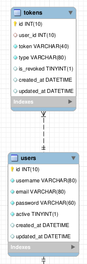

# 1. Raspberry Pi Home Web Service

This Web Service is a personal project meant to be a backend to a home website.
This document will go through every step of the development of the web service and will present the motivation, what objectives it aims to achieve and what is needed to meet the requirements gathered.
Please understand that english is not my main language so I'll do my best to keep my writing simple and concise and hopefully this project will be of any assistance to you.

## 1.1. Index

<!-- TOC -->

- [1. Raspberry Pi Home Web Service](#1-raspberry-pi-home-web-service)
  - [1.1. Index](#11-index)
  - [1.2. Motivation and objectives](#12-motivation-and-objectives)
  - [1.3. Getting started](#13-getting-started)
  - [1.4. Features](#14-features)
  - [1.5. Backend](#15-backend)
    - [1.5.1. Database](#151-database)
    - [1.5.2. User Register/Login](#152-user-registerlogin)
    - [1.5.3. Check devices information](#153-check-devices-information)
    - [1.5.4. Files & Printer Jobs](#154-files--printer-jobs)
    - [1.5.5. Errands / To Do List](#155-errands--to-do-list)
    - [1.5.6. Check family photos](#156-check-family-photos)
    - [1.5.7. User chat](#157-user-chat)
    - [1.5.8. Movie/Series provider](#158-movieseries-provider)
    - [1.5.9. Endpoints](#159-endpoints)
      - [1.5.9.1. Auth Controller](#1591-auth-controller)
      - [1.5.9.2. User Controller](#1592-user-controller)
      - [1.5.9.3. File Controller](#1593-file-controller)
      - [1.5.9.4. Job Controller](#1594-job-controller)
      - [1.5.9.5. Device Controller](#1595-device-controller)
      - [1.5.9.6. Offer devices interaction](#1596-offer-devices-interaction)
        - [1.5.9.6.1. Smart TV](#15961-smart-tv)
        - [1.5.9.6.2. Smart Light Bulb](#15962-smart-light-bulb)
        - [1.5.9.6.3. Printer](#15963-printer)
      - [1.5.9.7. List Controller](#1597-list-controller)
      - [1.5.9.8. Torrent Controller](#1598-torrent-controller)
  - [1.6. Bibliography](#16-bibliography)

<!-- /TOC -->

## 1.2. Motivation and objectives 

Over the time I have bought some smart devices. But one thing I realized is that for every different one I need a specific web/mobile app to interact with it, so I decided to give it a try and gather all of them in a single place.

I want to have a web service that gathers all of my favourite smart devices and let me interact with them. And I want to do it in a way that will be easy to add a new device if I happen to acquire one.

This web service will serve as the backend of a web application that will provide me with the interface to interact with the devices and fullfill all other kinds of usefull stuff like a home chat, a to do list shared by all the users, etc..

## 1.3. Getting started

To start the web service it's necessary that you have all the dependencies installed and for that run `npm install`. Next all you need to do is to start server with `adonis serve --dev` to launch it on developer mode.

## 1.4. Features 

1. User Register/Login.
2. Check devices information.
3. Offer devices interaction.
7. Errands/To do list.
8. Check family photos.
6. User chat.
9. Movie/Series provider.

## 1.5. Backend 

All of the backend is going to be written in Node.js, I used a node framework called Adonis.

"Adonis is a Node.js MVC web framework that runs on all operating systems. It offers a stable eco-system to write a server-side web application so that you can focus on business needs over finalizing which package to choose or not.

AdonisJs favours developer joy with consistent and expressive API to build a full-stack web application or a micro API server."

As I'm writing this Adonis is in version 4.0 and I used the api-only blueprint because I'm only focused on building a REST API so I can then procede to build frontend on any platform I'd like.

I'm using Adonis because it supports Authentication, SQL ORM, Data validation and sanitization, and a lot more features wich are helpful for developing a backend system.

### 1.5.1. Database 

I used MySQL, because that's the one I'm more familiarized with and Adonis supports it out of the box so it was easy to integrate the database with the web service.

Along each feature I'll be more detailed about what made me make each decision and how I ended up with my databse schema.

### 1.5.2. User Register/Login 

Adonis api-only blue print already comes with a ready to run implementation with users and authentication setup. I only tweaked it a little to match my requirements.

I used an API type of authentication, this consists on every user getting an API Key so that they can make requests to the server. This API is obtainable by sending user credentials through an endpoint.

User registation and login are available through /login and /register endpoints.

Users are their own entity in the database, each one has an id, username, email and password. This is all the information I need to store about a single user along with a Boolean to keep track if that user is active or not so I dont delete it.

Has I said before every user needs an API token/key, that its generated by the server. This API token is saved in the database to keep record of the API keys that are available to each user or to check if it's expired or not.

### 1.5.3. Check devices information 

This is one of the most important features in the web service, it's the whole reason I decided to make it so I needed to be able to make it work.

At first I didn't know how to do this but, after I received my smart light bulb I figured out how to try and do it. The light bulb had Wifi and I was able to control it through an android app but I didnt bought the lamp just because if the android app, I bought it because of the API it offered. With this API I could manually controll it through socket communication, but first I needed to know its IP address or if it was on/off. Luckly they had pretty decent documentation and I learnt about the SSDP protocol.

The SSDP (Simple Service Discovery Protocol) is a network protocol based on the IP Suite for advertisement and discovery of network services and presence information. To be able to find all devices in my network I need to send a M-SEARCH request in multicast address (239.255.255.250) and wait for the devices to respond back, if I obtain response I acknowledge the device and save it in the database, if I already have saved it then I just update the new information.

I couldn't seem to be able to detect wich type of device it is just by finding it through SSDP so I just save its IP and MAC address (through ARP table) in the database and manually add information like its name, type, etc. Since it's going to be a home web service I'll have my devices pretty much figured out but if I ever happen to add another device to the network I'll be able to know when it is on.

I think I achieved my goal with this approach, maybe with time I'll get more knowledge and think about a better solution to this problem.

I save all my devices in a specific table and with all the information I'm provided so I can be able to make SSDP requests to a specific device and see if it is online or not.

### 1.5.4. Files & Printer Jobs 

One of the devices I wanted to be able to manage was my home printer. I was able to make an endpoint so I could submit a file and the name of the printer and the server will print the file at the designated printer. This is a nice feature but I wanted to be able to track what files were printed by wich printer and by wich user so, to keep an history of jobs submitted I created two new entities *files* and *jobs*.

As you can see in the image from the last section a file has the information about the name, path where it's stored and type. The file is stored in the server as well so I can reprint a file or download an uploaded file.

Except for the files uploaded to be printed, all other files can be organized in different folders if the user wants.

A job is associated with an user, a device and a file and stores the job_id and the date wich was created.

### 1.5.5. Errands / To Do List

A nice feature that every house website should have is to be able to create lists and add tasks to those lists. A grocerie's list for example, it would be nice that everyone in the house could be able to contribute to the list!

I have implemented this feature indentificating two different entities, List and Task as shown below:

As we can see a list is associated to an user so it is possible to indentify who was the one creating it and a task is attached to a list and has a status to keep track of its state.

It is not mandatory for a list to have tasks. I designed it that way because a list can serve just as an errand or warning that's why put the text attribute.

### 1.5.6. Check family photos

The backend is meant to stay in the same server that's providing the frontend so that when requesting the files through the specified API the frontend can get the files itself.

The files are organized in folders, and I've created an index in the *folder* attribute so that queries that need to look for files in a specific folder can be faster.

### 1.5.7. User chat

This webservice provides a TCP socket server that users can connect and chat. The server is located at localhost, port 1212.

If someone wants to connect to the server it's necessary that the client side, upon connection, provide the server with the username of the client. The first string that is sended to the server is meant to be consumed so the server can distinguish the different users.

Repeated usernames are not allowed, so if a username is already taken the server will reply with a repeated username protocol string: *"Server_User_Unaccepted"*. If an username is not available the client shall resend another string with another username until it receives *"Server_User_Accepted"*.

To disconnect an user the client can forcefully send a disconnect protocol string, *"/exit"*, message to the server.

The chat server, as of now, is only capable of send and receive messages to their users but I pretend to add more functionalities like change username, whisper to a certain user, etc..

### 1.5.8. Movie/Series provider

It is possible to ask for a certain torrent to be downloaded and query about its status. The web service provides an socket server that listens on port 2121 for torrent download requests. Alternatively to this socket server the web service offers a RESTful API as an interface to communicate with the socket server.

The endpoints support all types of interaction with the socket server by abstracting the connection to the server and by handling all the protocols when issuing the requests. The endpoints are specified in [this](#1498-torrent-controller) section.

If, for some reason, someone would like to communicate through direct connection to the socket server these are the supported protocols:

- **Downloads a torrent:** *Add \<torrentId\>*
- **Shows all torrents:** *All*
- **Checks for status (see WebTorrent API):** *Check \<property\> \<torrentId\>*
- **Pauses a torrent:** *Pause \<torrentId\>*
- **Resumes a torrent:** *Resume \<torrentId\>*

Torrents are downloaded to the *torrents* folder. After the download is complete the main file is saved to the database so it can be accessed.

### 1.5.9. Endpoints

Here I'll go through every endpoint that exists in the web service and document it. I did not included the standard header parameters because every one of them except the files and smart tv one accept *Content-Type: application/json*.

#### 1.5.9.1. Auth Controller

| URL              | Method         | Header Params | Data Params | Description                | Response |
| ---------------- |:------------:| :-----------: | :--------: | :-------------- | :--------: |
| /api/v1/login     | POST          | Required: <ul><li> None </li></ul> | Required: <ul><li> username: String </li><li>password: String</li></ul> | Validates login | Content: { type: String, token: String} |
| /api/v1/logout | POST         | Required: <ul><li> Bearer \<token\> </li></ul> | Required: <ul><li>None</li></ul> | Logs the user out |  Content: { id: Int, name: String, active: Boolean, created_at: String, updated_at: String } |

#### 1.5.9.2. User Controller

| URL              | Method         | Header Params | Data Params | Description                  | Response |
| ---------------- |:------------:| :-----------: | :--------: | :---------------------------| :----------: |
| /api/v1/user     | GET          | Required: <ul><li> Bearer \<token\> </li></ul> | Required: <ul><li> None </li></ul> | Show a list of all the users | Content: [JSON Array with users data]|
| /api/v1/user     | POST         | Required: <ul><li> Bearer \<token\> </li></ul> | Required: <ul><li>name: String</li><li>email: String</li><li>password: String</li></ul> | Creates a new user | Content: { id: Int, name: String, active: Boolean, created_at: String, updated_at: String } |
| /api/v1/user/:id | GET          | Required: <ul><li> Bearer \<token\> </li></ul> | Required: <ul><li> None </li></ul> | Displays a single user | Content: { id: Int, name: String, active: Boolean, created_at: String, updated_at: String } |
| /api/v1/user/:id | PUT or PATCH | Required: <ul><li> Bearer \<token\> </li></ul> | Required: <ul><li>None</li></ul> Optional: <ul><li>name: String</li><li>email: String</li><li>password: String</li></ul> | Update user details | Content: { id: Int, name: String, active: Boolean, created_at: String, updated_at: String } |
| /api/v1/user/:id | DELETE       | Required: <ul><li> Bearer \<token\> </li></ul> | Required: <ul><li> None </li></ul> | Delete a user with id | Content: { id: Int, name: String, active: Boolean, created_at: String, updated_at: String } |

#### 1.5.9.3. File Controller

| URL              | Method         | Header Params | Data Params | Description                  | Response |
| ---------------- |:------------:| :-----------: | :--------: | :---------------------------| :----------: |
| /api/v1/file     | GET          | Required: <ul><li> Bearer \<token\> </li></ul> | Required: <ul><li> None </li></ul> | Show a list of all the files | Content: [JSON Array with files data]|
| /api/v1/file     | POST         | Required: <ul><li> Bearer \<token\><li> Content-Type: multipart/form-data </li></ul> | Required: <ul><li>file: [Binary] </li></ul> Optional: <ul><li> folder: String </li></ul> | Creates a new file | Content: { id: Int, name: String, path: String, folder: String, type: String, created_at: String, updated_at: String } |
| /api/v1/file/:id | GET          | Required: <ul><li> Bearer \<token\> </li></ul> | Required: <ul><li> None </li></ul> | Displays a single file | Content: { id: Int, name: String, path: String, folder: String, type: String, created_at: String, updated_at: String } |
| /api/v1/file/:id | PUT or PATCH | Required: <ul><li> Bearer \<token\> </li></ul> | Required: <ul><li>None</li></ul> Optional: <ul><li>name: String</li><li>email: String</li><li>password: String</li></ul> | Update file details | Content: { id: Int, name: String, path: String, folder: String, type: String, created_at: String, updated_at: String } |
| /api/v1/file/:id | DELETE       | Required: <ul><li> Bearer \<token\> </li></ul> | Required: <ul><li> None </li></ul> | Delete a file with id | Content: { id: Int, name: String, path: String, folder: String, type: String, created_at: String, updated_at: String } |
| /api/v1/file/uploaded/:folder | GET | Required: <ul><li> Bearer \<token\> </li></ul> | Required: <ul><li> None </li></ul> | Gets all the files in the specified folder | Content: [JSON Array with files data]
| /api/v1/file/folders/get | GET | Required: <ul><li> Bearer \<token\> </li></ul> | Required: <ul><li> None </li></ul> | Gets all folders where files are stored | Content: [JSON Array with folders name]

Note: Files that are uploaded without specifing the folder are stored in the root of the */uploaded/* directory.

#### 1.5.9.4. Job Controller

| URL              | Method         | Header Params | Data Params | Description                  | Response |
| ---------------- |:------------:| :-----------: | :--------: | :---------------------------| :----------: |
| /api/v1/job     | GET          | Required: <ul><li> Bearer \<token\> </li></ul> | Required: <ul><li> None </li></ul> | Show a list of all the jobs | Content: [JSON Array with jobs data]|
| /api/v1/job/:id | GET          | Required: <ul><li> Bearer \<token\> </li></ul> | Required: <ul><li> None </li></ul> | Displays a single job | Content: { id: Int, user_id: Int, device_Id: Int, file_id: Int, created_at: String, updated_at: String } |
| /api/v1/job/:id | DELETE       | Required: <ul><li> Bearer \<token\> </li></ul> | Required: <ul><li> None </li></ul> | Delete a job with id | Content: { id: Int, user_id: Int, device_Id: Int, file_id: Int, created_at: String, updated_at: String } |

#### 1.5.9.5. Device Controller

| URL              | Method         | Header Params | Data Params | Description                  | Response |
| ---------------- |:------------:| :-----------: | :--------: | :---------------------------| :----------: |
| /api/v1/device     | GET          | Required: <ul><li> Bearer \<token\> </li></ul> | Required: <ul><li> None </li></ul> | Show a list of all the devices | Content: [JSON Array with devices data]|
| /api/v1/device     | POST         | Required: <ul><li> Bearer \<token\> </li></ul> | Required: <ul><li>mac_address: String</li><li>active: Boolean</li><li>on_off: Boolean</li></ul> Optional: <ul><li>name: String</li><li>type: String</li><li>ip: String</li></ul> | Creates a new device | Content: { id: Int, name: String, mac_address: String, type: String, ip: String, active: Boolean, created_at: String, updated_at: String } |
| /api/v1/device/:id | GET          | Required: <ul><li> Bearer \<token\> </li></ul> | Required: <ul><li> None </li></ul> | Displays a single device | Content: { id: Int, name: String, mac_address: String, type: String, ip: String, active: Boolean, created_at: String, updated_at: String } |
| /api/v1/device/:id | PUT or PATCH | Required: <ul><li> Bearer \<token\> </li></ul> | Required: <ul></ul> Optional: <ul><li>name: String</li><li>mac_address: String</li><li>type: String</li><li>ip: String</li><li>active: Boolean</li><li>on_off: Boolean</li></ul> | Update device details | Content: { id: Int, name: String, mac_address: String, type: String, ip: String, active: Boolean, created_at: String, updated_at: String } |
| /api/v1/device/:id | DELETE       | Required: <ul><li> Bearer \<token\> </li></ul> | Required: <ul><li> None </li></ul> | Delete a device with id | Content: { id: Int, name: String, mac_address: String, type: String, ip: String, active: Boolean, created_at: String, updated_at: String } |

#### 1.5.9.6. Offer devices interaction 

To be able to offer device interaction I nedded to, for each type of device, have a REST resource. In Adonis I can do it in a very simple way buy creating Controllers wich implements a set of methods that will be used in the different REST endpoints.

The server searches for devices in the network and updates the database with all the information gathered. It is then possible to scan for a device to check if it is connected (online) or not through the following endpoint.

| URL              | Method         | Header Params | Data Params | Description                  | Response |
| ---------------- |:------------:| :-----------: | :--------: | :---------------------------| :----------: |
| /api/v1/device/scan     | POST         | Required: <ul><li> Bearer \<token\> </li></ul> | Required: <ul><li>id: Int</li></ul> | Scans a device to see if its active | Content: { ip: String, active: Boolean } |

##### 1.5.9.6.1. Smart TV

The current interaction endpoints are for my LG Smart TV. I searched in the internet for the API since LG uses WebOS (wich is open source) but I was able to find what it seemed to be documentation for the newer versions of the Smart TV. My TV is from 2012 so I was only able to find small projects with and reverse engineer to get them working on my mine. If I ever happen to upgrade the TV I will probably also need to update the backend.

What I found while reverse engineering is that to be able to issue a remote command to the Smart TV I'd need to go through a pairing process first. So, the endpoints I created are designed to go through that pairing process and do not automate it.

The pairing process:

- Get the pairing key:
  - This key will appear on the TV Screen so the user will have to write it down.

- Get the session id:
  - After getting the pairing key it is needed to get a session id in order to validate the session.
  - A session id is at least 8 characters long if the id does not meet this requirement the session is not valid and the TV will not respond to any command.

- Issue the command:
  - After the two above steps it is possible to issue commands to the TV without needing to pair each time a command is issued.
  - The TV keeps a register of the devices paired, but at one point I think that, that register expires and it will be necessary to update it getting another session id. I'll update this section when more information.

As explained above the endpoints that make the pairing process possible are listed below:

| URL              | Method         | Header Params | Data Params | Description                  | Response |
| ---------------- |:------------:| :-----------: | :--------: | :---------------------------| :----------: |
| /api/v1/tv/displayKey | POST | Required: <ul><li> Bearer \<token\> </li></ul> | Required: <ul><li> id: Int </li></ul> | Requires pairing key to smart TV | Content: {ROAPError: [String], ROAPErrorDetail: [String]} |
| /api/v1/tv/getSessionId | POST | Required: <ul><li> Bearer \<token\> </li></ul> | Required: <ul><li> id: Int </li><li> pairingKey: String </li></ul> | Gets a session id with pairing key | Content: {ROAPError: [String], ROAPErrorDetail: [String]} |
| /api/v1/tv/handleCommand | POST | Required: <ul><li> Bearer \<token\> </li></ul> | Required: <ul><li> id: Int </li><li> cmdCode: Int </li></ul> | Issues command to Smart TV | Content: {ROAPError: [String], ROAPErrorDetail: [String]} |

The list of command codes is the following:

|Virtual key code (decimal number)|Description|
| :---: | :---: |
|1|POWER|
|2|Number 0|
|3|Number 1|
|4|Number 2|
|5|Number 3|
|6|Number 4|
|7|Number 5|
|8|Number 6|
|9|Number 7|
|10|Number 8|
|11|Number 9|
|12|UP key among remote Controller’s 4 direction keys|
|13|DOWN key among remote Controller’s 4 direction keys|
|14|LEFT key among remote Controller’s 4 direction keys|
|15|RIGHT key among remote Controller’s 4 direction keys|
|20|OK|
|21|Home menu|
|22|Menu key (same with Home menu key)|
|23|Previous key (Back)|
|24|Volume up|
|25|Volume down|
|26|Mute (toggle)|
|27|Channel UP (+)|
|28|Channel DOWN (-)|
|29|Blue key of data broadcast|
|30|Green key of data broadcast|
|31|Red key of data broadcast|
|32|Yellow key of data broadcast|
|33|Play|
|34|Pause|
|35|Stop|
|36|Fast forward (FF)|
|37|Rewind (REW)|
|38|Skip Forward|
|39|Skip Backward|
|40|Record|
|41|Recording list|
|42|Repeat|
|43|Live TV|
|44|EPG|
|45|Current program information|
|46|Aspect ratio|
|47|External input|
|48|PIP secondary video|
|49|Show / Change subtitle|
|50|Program list|
|51|Tele Text|
|52|Mark|
|400|3D Video|
|401|3D L/R|
|402|Dash (-)|
|403|Previous channel (Flash back)|
|404|Favorite channel|
|405|Quick menu|
|406|Text Option|
|407|Audio Description|
|408|NetCast key (same with Home menu)|
|409|Energy saving|
|410|A/V mode|
|411|SIMPLINK|
|412|Exit|
|413|Reservation programs list|
|414|PIP channel UP|
|415|PIP channel DOWN|
|416|Switching between primary/secondary video|
|417|My Apps|

##### 1.5.9.6.2. Smart Light Bulb

Luckily Yeelight Smart LED Bulb comes designed to be used in LAN and offers documentation that explains how to do so.

These LED light bulbs can be discovered using the SSDP protocol by sending a *M-SEARCH* message through the multicast address in port 1982, it is a different port so the server must send a separate message just to search for this light bulbs.

When a light bulb is detected it sends to the server all of its information including the port where it is listening to commands. These light bulbs do not offer specific endpoints to issue commands through HTTP like the smart tv so, it will be needed to setup a TCP connection to the LED.

This TCP connection is abstracted by an endpoint that was created to send individual commands directioned to the light bulb. I do not know if it is a good idea to abstract it like this because, in this case, a TCP connection would be much more fast, however I'm letting know, whoever is reading this, that I still provide all the necessary information about the device itself, to make the TCP connection, through one of the endpoints mentioned in the [Device Controller](#1455-device-controller).

| URL              | Method         | Header Params | Data Params | Description                  | Response |
| ---------------- |:------------:| :-----------: | :--------: | :---------------------------| :----------: |
| /api/v1/led/handleCommand | POST | Required: <ul><li> Bearer \<token\> </li></ul> | Required: <ul><li> method: String </li><li> params: [String] </li></ul> | Issues command to LED Light Bulb | Content: {id: Int, result: [String]} |

The value of *id* is an integer filled by the message sender. It will be echoed back in *RESULT*
message. This is to help whoever sent the request to know wich request and response is his.

The value of *method* is a string that specifies which control method the sender wants to
invoke. The value must be chosen by sender from one of the methods that listed in *SUPPORT* header in advertisement request or search response message. Otherwise, the message will be rejected by smart LED.

The value of *params* is an array. The values in the array are method specific.

Example:
`{ "id": 1, "method": "set_power", "params":["on", "smooth", 500] }`

Following is the list of all supported methods and parameters.

| Method value | Parameters Count | Param 1 | Param 2 | Param 3 | Param 4 |
| :---: | :---: | :---: | :---: | :---: | :---: | :---: |
get_prop | 1 ~ N | * | * | * | * |
set_ct_abx | 3 | int(ct_value) | string(effect) | int(duration) |
set_rgb | 3 | int(rgb_value) | string(effect) | int(duration) |
set_hsv | 4 | int(hue) | int(sat) | string(effect) | int(duration) |
set_bright | 3 | int(brightness) | string(effect) | int(duration) |
set_power | 3 | string(power) | string(effect) | int(duration) | int(mode) |
toggle | 0 |
set_default | 0 |
start_cf | 3 | int(count) | int(action) | string(flow_expression) |
stop_cf | 0 |
set_scene | 3 ~ 4 | string(class) | int(val1) | int(val2) | *int(val3) |
cron_add | 2 | int(type) | int(value) |
cron_get | 1 | int(type) |
cron_del | 1 | int(type) |
set_adjust | 2 | string(action) | string(prop) |
set_music | 1 ~ 3 | int(action) | string(host) | int(port) |
set_name | 1 | string(name) |
bg_set_rgb | 3 | int(rgb_value) | string(effect) | int(duration) |
bg_set_hsv | 4 | int(hue) | int(sat) | string(effect) | int(duration) |
bg_set_ct_abx | 3 | int(ct_value) | string(effect) | int(duration) |
bg_start_cf | 3 | int(count) | int(action) | string(flow_expression) |
bg_stop_cf | 0 |
bg_set_scene | 3 ~ 4 | string(class) | int(val1) | int(val2) | *int(val3) |
bg_set_default | 0 |
bg_set_power | 3 | string(power) | string(effect) | int(duration) | int(mode) |
bg_set_bright | 3 | int(brightness) | string(effect) | int(duration) |
bg_set_adjust | 2 | string(action) | string(prop) |
bg_toggle | 0 |
dev_toggle | 0 |

For more information about these methods check out the documentation from Yeelight's website.

##### 1.5.9.6.3. Printer

I am able to discover any new printers in the LAN but I still haven't figured out how to setup newly discovered printers through CUPS. In the meanwhile I'll have to do it manually after the device is detected.

I also rely on the user knowledge to print with more advanced configurations, because I only offer one endpoint to print a file. This endpoint receives a new file or the id of an existing file as well as an optional configuration string that will be passed to a `lp` command.

| URL              | Method         | Header Params | Data Params | Description                  | Response |
| ---------------- |:------------:| :-----------: | :--------: | :---------------------------| :----------: |
| /api/v1/printer/print | POST | Required: <ul><li> Bearer \<token\> </li></ul> | Required: <ul><li> lprinter_id: Int </li></ul> Optional <ul><li> config: String </li></ul> | Prints a file | Content: { job: JSON object with job data, file: JSON object with file data } |

It supports *jpg*, *png*, *jpeg*, *txt* and *pdf* file types and a maximum of 50mb  per file. All files are stored and can be reprinted.

#### 1.5.9.7. List Controller

It is possible to create new lists and/or add new tasks through the following endpoints.

| URL              | Method         | Header Params | Data Params | Description                  | Response |
| ---------------- |:------------:| :-----------: | :--------: | :---------------------------| :----------: |
| /api/v1/list     | GET          | Required: <ul><li> Bearer \<token\> </li></ul> | Required: <ul><li> None </li></ul> | Show a list of all the lists | Content: { lists: [JSON Array with files data], tasks: [JSON Array with tasks data]|
| /api/v1/list     | POST         | Required: <ul><li> Bearer \<token\></ul> | Required: <ul><li>name: String </li><li>end_date: String</li></ul> Optional: <ul><li> text: String </li></ul> | Creates a new list | Content: { id: Int, name: String, text: String, end_date: String, user_id: Int, created_at: String, updated_at: String } |
| /api/v1/list/:id | GET          | Required: <ul><li> Bearer \<token\> </li></ul> | Required: <ul><li> None </li></ul> | Displays a single list | Content: { list: { id: Int, name: String, text: String, end_date: String, user_id: Int, created_at: String, updated_at: String }, tasks: [JSON Array with tasks data] } |
| /api/v1/list/:id | PUT or PATCH | Required: <ul><li> Bearer \<token\> </li></ul> | Required: <ul><li>None</li></ul> Optional: <ul><li>name: String</li><li>text: String</li><li>end_date: String</li></ul> | Updates list details | Content: { id: Int, name: String, text: String, end_date: String, user_id: Int, created_at: String, updated_at: String } |
| /api/v1/file/:id | DELETE       | Required: <ul><li> Bearer \<token\> </li></ul> | Required: <ul><li> None </li></ul> | Deletes a list with id | Content: { id: Int, name: String, text: String, end_date: String, user_id: Int, created_at: String, updated_at: String } |
| /api/v1/list/:id/add | POST | Required: <ul><li> Bearer \<token\> </li></ul> | Required: <ul><li> description: String </li><li>status: String</li></ul> | Creates a new task associated to the list with id | Content: { id: Int, description: String, status: String, list_id: Int, created_at: String, updated_at: String } |
| /api/v1/task/:id | PUT | Required: <ul><li> Bearer \<token\> </li></ul> | Required: <ul><li>None</li></ul> Optional: <ul><li>description: String</li><li>status: String</li></ul> | Updates a task associated with an id | Content: { id: Int, description: String, status: String, list_id: Int, created_at: String, updated_at: String } |
| /api/v1/task/:id | DELETE | Required: <ul><li> Bearer \<token\> </li></ul> | Required: <ul><li> None </li></ul> | Deletes a task associated with an id | Content: { id: Int, description: String, status: String, list_id: Int, created_at: String, updated_at: String } |

#### 1.5.9.8. Torrent Controller

It is possible to add a new torrent to download or to check a certain torrent status through the following endpoints.

| URL              | Method         | Header Params | Data Params | Description                  | Response |
| ---------------- |:------------:| :-----------: | :--------: | :---------------------------| :----------: |
| /api/v1/torrent/add | POST | Required: <ul><li> Bearer \<token\> </li></ul> | Required: <ul><li> magnetURI: String </li></ul> | Adds new torrent to be downloaded | Content: { id: Int, name: String, path: String, folder: String, type: String, created_at: String, updated_at: String } |
| /api/v1/torrent/all | GET | Required: <ul><li> Bearer \<token\> </li></ul> | Required: <ul><li> None </li></ul> | Shows all torrents | Content: [JSON Array with torrents data]|
| /api/v1/torrent/check | POST | Required: <ul><li> Bearer \<token\> </li></ul> | Required: <ul><li> magnetURI: String </li><li>property: String</li></ul> | Checks a torrent by id | Content: { \<propertyName\>: \<propertyType\> }|
| /api/v1/torrent/pause | POST | Required: <ul><li> Bearer \<token\> </li></ul> | Required: <ul><li> magnetURI: String </li></ul> | Pauses a torrent by id | Content: { progress: Int }|
| /api/v1/torrent/resume | POST | Required: <ul><li> Bearer \<token\> </li></ul> | Required: <ul><li> magnetURI: String </li></ul> | Resumes a torrent by id | Content: { progress: Int }|

Available torrent properties:

- **infoHash:** Info hash of the torrent (string).
- **magnetURI:** Magnet URI of the torrent (string).
- **torrentFile:** .torrent file of the torrent (Buffer).
- **files:** Array of all files in the torrent. See documentation for File (WebTorrent API) to learn what methods/properties files have.
- **timeRemaining**: Time remaining for download to complete (in milliseconds).
- **received:** Total bytes received from peers (including invalid data).
- **downloaded:** Total verified bytes received from peers.
- **uploaded:** Total bytes uploaded to peers.
- **downloadSpeed:** Torrent download speed, in bytes/sec.
- **uploadSpeed:** Torrent upload speed, in bytes/sec.
- **progress:** Torrent download progress, from 0 to 1.
- **ratio:** Torrent "seed ratio" (uploaded / downloaded), from 0 to 1.
- **numPeers:** Number of peers in the torrent swarm.
- **path:** Torrent download location.

When adding a new torrent make sure to safeguard from errors:

| Error Description | Response |
| --- | :---: |
| Added a duplicate torrent, that already is/was downloaded. | Content: { error: "Duplicate torrent" } |

## 1.6. Bibliography

Request Pairing Key, 23 January 2018, [http://developer.lgappstv.com/TV_HELP/index.jsp?topic=%2Flge.tvsdk.references.book%2Fhtml%2FUDAP%2FUDAP%2FLG+UDAP+2+0+Protocol+Specifications.html](http://developer.lgappstv.com/TV_HELP/index.jsp?topic=%2Flge.tvsdk.references.book%2Fhtml%2FUDAP%2FUDAP%2FLG+UDAP+2+0+Protocol+Specifications.html)

LG 2012 Smart TV, 2016, 23 January 2018, [https://www.domoticz.com/wiki/LG_2012_smart_tv](https://www.domoticz.com/wiki/LG_2012_smart_tv)

PHP-LG-SmartTV, 2015, 23 January 2018,   [https://github.com/SteveWinfield/PHP-LG-SmartTV](https://github.com/SteveWinfield/PHP-LG-SmartTV)

Yeelight Developer, 2015, 28 January 2018, [https://www.yeelight.com/en_US/developer](https://www.yeelight.com/en_US/developer)

The Printing HOWTO, 2003, 28 January 2018, [https://www.tldp.org/HOWTO/Printing-HOWTO/setup.html](https://www.tldp.org/HOWTO/Printing-HOWTO/setup.html)

WebTorrent API Document, 30 January 2018, [https://webtorrent.io/docs](https://webtorrent.io/docs)

Popcorn Time API, 30 January 2018, [https://popcorntime.api-docs.io/api/movie/mZmcWu9q5P5RpzNHW](https://popcorntime.api-docs.io/api/movie/mZmcWu9q5P5RpzNHW)

EZTV API, 30 January 2018, [https://eztv.ag/api/](https://eztv.ag/api/)